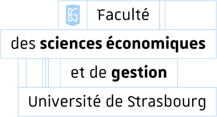
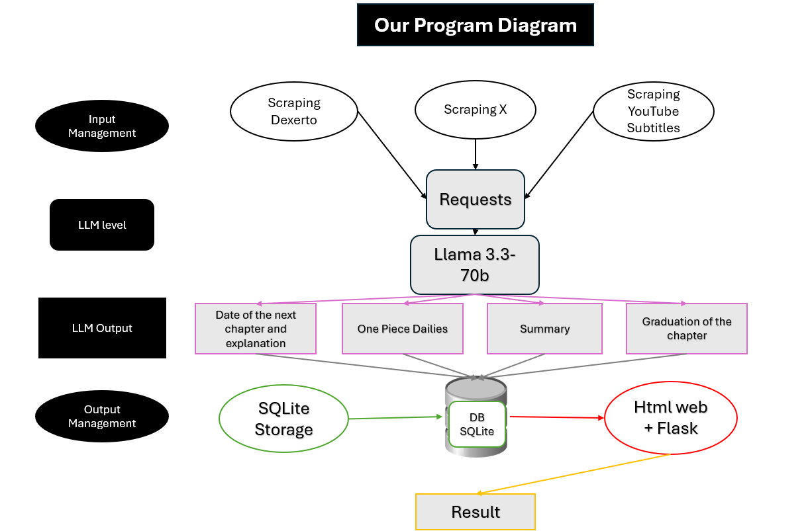

# **Scan One Piece**



- **Valentin Barthel**  
- **Nathan Dubourg**  
- **Werner Laemlin**
---

# Introduction : Schéma Explicatif


---
# Introduction : Présentation de l'arborescence

```
├── flaskr
│   ├── add_db.py
│   ├── db.py
│   ├── generate
│   │   └── llm_summary.py
│   ├── init.py
│   ├── scraping
│   │   ├── get_latest_scan.py
│   │   ├── init.py
│   │   ├── working_x_scrap.py
│   │   ├── youtube_api
│   │   │   ├── _error.py
│   │   │   ├── get_link.py
│   │   │   └── init.py
│   │   └── yt_subtitles.py
│   ├── static
│   │   └── op_background.jpg
│   ├── templates
│   │   ├── base.html
│   │   ├── explanation.html
│   │   ├── info.html
│   │   └── theories.html
│   ├── text_routes.py
│   └── text_schema.sql
├── git_tuto.md
├── instance
│   └── flaskr.sqlite
├── README.md
└── requirements.txt
```
---
# Scraping : 
## -Script subtitles vidéo youtube

[`yt_subtitles.py`](https://github.com/wlemalin/one_piece_scan/blob/main/flaskr/scraping/yt_subtitles.py)

## -Script Dexerto pour obtenir les prochaines dates de sortie

[`get_latest_scan.py`](https://github.com/wlemalin/one_piece_scan/blob/main/flaskr/scraping/get_latest_scan.py)


## -Script X pour obtenir les prochaines dates de sortie

[`working_x_scrap.py`](https://github.com/wlemalin/one_piece_scan/blob/main/flaskr/scraping/working_x_scrap.py)

---

# DB : SQLite storage

[`add_db.py`](https://github.com/wlemalin/one_piece_scan/blob/main/flaskr/add_db.py)

[`db.py`](https://github.com/wlemalin/one_piece_scan/blob/main/flaskr/db.py)

[`text_schema.sql`](https://github.com/wlemalin/one_piece_scan/blob/main/flaskr/text_schema.sql)

---
# AI : Llama 3.3-70b (Dextero)

[llm_summary.py](https://github.com/wlemalin/one_piece_scan/blob/main/flaskr/generate/llm_summary.py)

```
- > Prompt Dexerto:
        '- **Synthesize the informations**'
        ' Below you will find the reasons why the last One Piece scan is not available.'
        ' Using theses informations you will write a paragraph to explain the situation to one piece fans.'
        ' You wil write a paragraph that clearly explains the reasons that caused the problem.'
        ' If informations on the new release date is available, you should include it in your explanation.'
        ' You will only write the explanations in quote and do not write any introduction phrase before.'
        ' Your answers should always contain close to 500 characters.'

- > Prompt Subtitles:
        ' Below you will find a subtitle from a video.'
        ' Using theses informations you will write a paragraph to explain the situation.'
        ' You will write a paragraph that clearly summarize the chapter to the fans with an hype intonation'
        ' Moreover, you will graduate the chapter on 10 in function of the sentiment of speecher in the video'
        ' Your answers should always contain close to 2000 characters.'
- > Prompt x:
        Synthesize informations and save the response
```
---
# Website
## Flask
[`__init__.py`](https://github.com/wlemalin/one_piece_scan/blob/main/flaskr/__init__.py)

[`text_routes.py`](https://github.com/wlemalin/one_piece_scan/blob/main/flaskr/text_routes.py)

## HTML
[`templates`](https://github.com/wlemalin/one_piece_scan/blob/main/flaskr/templates)

---
## Rendu terminal
        cf. Démo

---
## Limites :

